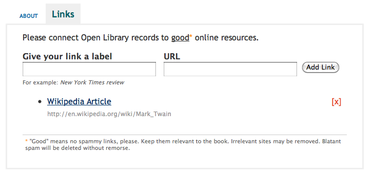
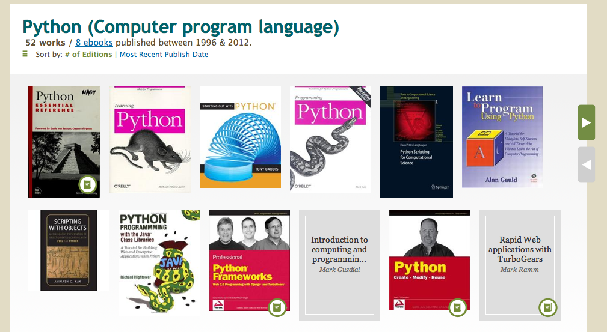

# pyjs: Compiling Python to Javascript

.fx: title-slide middle

 

    <a href="http://in.pycon.org/2011/" class="conf">PyCon India 2011</a>
     
    September 16-18, 2011

 
 

    <a class="author" href="http://anandology.com/">Anand Chitipothu</a>
     
    <a href="http://twitter.com/anandology" class="download-slides">@anandology</a>

 
 
 

<a href="http://bit.ly/pycon-fp" class="download-slides">http://bit.ly/pycon-pyjs</a>

---

# What is pyjs?

A tool to convert:
    
    !python
    def square(x):
        return x * x

to:

    !javascript
    function square(x) {
        return x * x;
    }

---

# Motivation

* Avoid writing templates both in Python and Javascript.

---

# Motivation (2)

Here is a sample from [Open Library project](https://github.com/internetarchive/openlibrary/blob/master/openlibrary/plugins/upstream/templates/books/edit/web.html#L54).

    <ul class="booklinks" id="links-display">
        <!-- JAVASCRIPT Template -->
        <li id="links-template" style="display: none;" class="repeat-item">
            
<a ...>[x]</a>

            <a href="{{url}}">{{title}}</a>
            {{url}}
            ...
        </li>

        <!-- PYTHON/web.py template -->
        $for index, link in enumerate(work.links):
            <li class="repeat-item">
                
<a ...>[x]</a>

                <a href="$link.url">$link.title</a>
                $link.url
                ...
            </li>
    </ul>

---

# Motivation (3)

---

# Motivation (4)

Here is a more complex example that renders html both on server and client: 

<http://openlibrary.org/subjects/python_(computer_program_language)>

---

# First Attempts - jsdef

* [jsdef - Javascript templating with web.py][jsdef]

Template: 

    $jsdef hello(name):
        Hello, $name!
    
    $hello("world")

generates the following HTML:
    
    
    Hello, world!
    

[jsdef]: http://anandology.com/blog/javascript-templating-with-webpy/

---

# jsdef - caveats

This won't work!

    $jsdef hello(name):
        Hello, $name.upper()!
    
    $hello("world")

It will generate:

    
    Hello, world!
    
---
    
# jsdef - caveats

Workaround:

    $code:
        def upper(s): return s.upper()
        
    
    
    $jsdef hello(name):
        Hello, $upper(name)!

    $hello("world")

The functionality of `upper` has to implemented separately in Python and Javascript.

UGLY!

---

# jsdef - complaints

* It is magic
* We can't understand knows how it works

--- 

# Idea!

* What if I compile Python to Javascript? 
* It is possible to compile the template to Python and Python to Javascript. 
* So it will be possible to use the same template at the client-side!

---

# pyjs

Started working on a new project.

<http://github.com/anandology/pyjs>

---

# But, one fine day...

I Found Pyjamas.

<http://pyjs.org>

---

# What is Pyjamas?

Pyjamas is a Rich Internet Application (RIA) Development Platform for both Web and Desktop.

It contains a **Python-to-Javascript compiler**, an AJAX framework and a Widget Set API. Pyjamas started life as a Python port of Google Web Toolkit, the Java-to-Javascript compiler.

----

# Oh, No!

---

# But Hacking AST is fun!

---

# What is AST?

Acronym for **Abstract Syntax Tree**.

**Example:**

    z = x * x + y * y
    
<pre>
          <b>=</b>
          |
      +---+---+
      |       |
      <b>z</b>       <b>+</b>
              |
        +-----+-----+
        |           |
        <b>*</b>           <b>*</b>
        |           |
    +---+---+   +---+---+
    |       |   |       |
    <b>x</b>       <b>x</b>   <b>y</b>       <b>y</b>
</pre>    

---

# AST in Python

<pre>
>>> import compiler
>>> compiler.parse('x = 1 + 2')
Module(None, Stmt(
                [<b>Assign(
                    [AssName('x', 'OP_ASSIGN')],
                    Add((Const(1), Const(2))))</b>]))
</pre>

**As tree:**

                    Assign
          +-----------+---------+
          |                     |
        AssName               Add                
     +----+-----+         +----+-----+ 
     |          |         |          |
    'x'    'OP_ASSIGN'  Const      Const
                          |          |
                          1          2
                          
---

# AST in Python

I wrote a small script to explore Python AST.

    $ ./scripts/compile.py 'y = x + 1'
    Module(None, Stmt([Assign([AssName('y', 'OP_ASSIGN')], Add((Name('x'), Const(1))))]))

Take `node.children[0].children[0]`.

    $ ./scripts/compile.py 'y = x + 1' 0 0
    Assign([AssName('y', 'OP_ASSIGN')], Add((Name('x'), Const(1))))

See what methods `Assign` class has.

    $ ./scripts/compile.py 'y = x + 1' 0 0 -e 'dir(node)'
    ['__doc__', '__init__', '__iter__', '__module__', '__repr__', 
    'asList', 'expr', 'getChildNodes', 'getChildren', 'lineno', 'nodes']

Lets see what is `expr`.

    $ ./scripts/compile.py 'y = x + 1' 0 0 -e 'node.expr'
    Add((Name('x'), Const(1)))

---

# How to generate Javascript?

* Traverse the AST recursively
* emit Javascript for each node.

---

# Traversing AST

    !python
    class Visitor:
        def visit(self, node):
            """Dispatches the call to visit_$nodetype method."""
            nodetype = node.__class__.__name__
            f = getattr(self, "visit_" + nodetype, self.generic_visit)
            return f(node)
            
        def generic_visit(self, node):
            pass

        def visit_Return(self, node):
            return "return %s;" % self.visit(node.value)

        def visit_While(self, node):
            condition, code, else_part = node.asList()
            return "while (%s) { %s } " % (self.visit(condition), self.visit(code))
            
        ...
        
* There is a `NodeVisitor` class in `ast` module, which provides the functionality of `visit` method.

----

# Traversing AST (2)

Slightly improved version.

    !python
    class Visitor(ast.NodeVisitor):
        def __init__(self):
            self.indent = 0
            self.buf = None
            
        def translate(self, node):
            self.buf = StringIO()
            self.visit(node)
            return self.buf.getvalue()

        def write(self, line, indent=False):
            if indent:
                self.buf.write("    " * self.indent)
            self.buf.write(line)
            return self
        
        def write_block(self, node):
            self.indent += 1
            self.visit(node)
            self.indent -= 1
        ...

---

# Traversing AST (3)

    !python
    class Visitor(ast.NodeVisitor):
        ...
        
        def visit_Add(self, node):
            self.visit(node.left)
            self.write(" + ")
            self.visit(node.right)

        def visit_If(self, node):
            test, code = node.tests[0]
            self.write("if (", indent=True)
            self.visit(test)
            self.write(") {\n")
            self.write_block(code)
            self.write("}", indent=True)

----

# Challenges - globals vs locals.

In Python variables are considered as local if undeclared. 

    !python
    def square(x):
        y = x * x # y is local
        return y

In javascript they are considered globals.        
        
    !javascript
    function square(x) {
        y = x * x; // y is global.
        return y;
    }

----

# Challenges - globals vs locals.

Correct translation:

**Python:**

    !python
    ncalls = 0
    def square(x):
        global ncalls   # declare ncalls as global
        ncalls += 1
        
        y = x * x
        return y

**Javascript:**

    !javascript
    ncalls = 0;
    function square(x) {
        var y;  // declare y as local
        ncalls += 1;
        y = x * x;
        return y;
    }

---    

# Challenges - mapping built-in types

**Python:**

    def uppercase(s):
        return s.upper()

**Javascript:**
    
    // this doesn't work
    function uppercase(s) {
        return s.upper();
    }

    // correct!
    function uppercase(s) {
        return py.getattr(s, "upper")();
    }

---

# Challenges - dunderscrore

Do we really need to support all `__foo__` magic?

    def f():
        """dummy function"""
        return 1
    x = f.__name__
    y = f.__doc__
    
---

# Challenges - readability

Readability counts!

**Python:**

    def fib(n):
        if n == 0 or n == 1:
            return 1
        else:
            return fib(n-1) + fib(n-2)

**Javascript generated by Pyjamas:**

    $m['fib'] = function(n) {
    	var $or1,$or2,$add3,$add4,$sub3,$sub2,$sub1,$sub4;
    	if ($p['bool'](($p['bool']($or1=$p['op_eq'](n, 0))?$or1:$p['op_eq'](n, 1)))) {
    		return 1;
    	}
    	else {
    		return $p['__op_add']($add3=$m['fib']($p['__op_sub']($sub1=n,$sub2=1)),
    		    $add4=$m['fib']($p['__op_sub']($sub3=n,$sub4=2)));
    	}
    	return null;
    };

---
# Summary

* Converting Python to Javascript is not that difficult
* It is tricky to correctly implement all the semantics
* 100% Python compatibility comes at a price
* It is hard to make the generated Javascript look similar to the python source

---

# Resources

There was an interesting talk on AST at US PyCon 2011.

[What would you do with an ast? - Matthew J Desmarais][ast-talk] - [video][ast-video]

[ast-talk]: http://us.pycon.org/2011/schedule/presentations/184/
[ast-video]: http://blip.tv/pycon-us-videos-2009-2010-2011/pycon-2011-what-would-you-do-with-an-ast-4898264

---

# Questions?

---- 

# Thanks!

The slides sources of this talk are available at:
    
<http://github.com/anandology/pyjs-talk>

